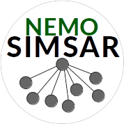
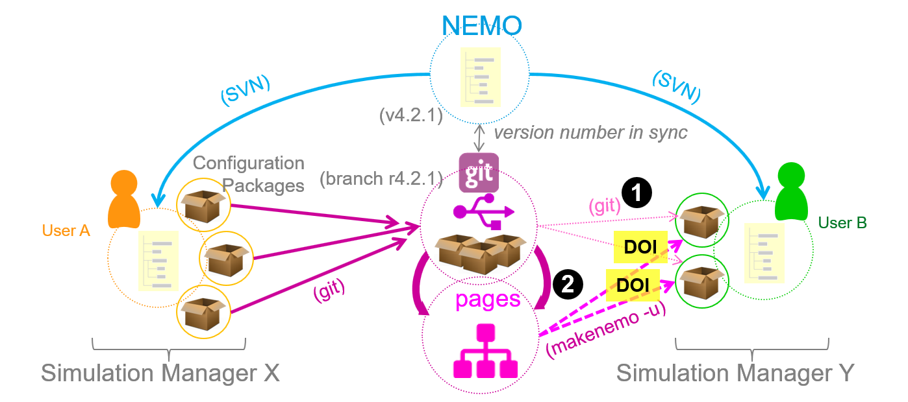

{: .center}

# nemo-simsar

*Document your NEMO ocean model simulations and share them with others using git remote repositories.*

<!--////-->

This project is part of the [IMMERSE Project](http://immerse-ocean.eu/) funded by the EC.

-----

## 1. Description

Ocean model simulations that are based on the NEMO ocean modelling framework ([nemo-ocean.eu](https://www.nemo-ocean.eu){: target=_blank}) consists of several components:

* The ***source code*** provided by NEMO and by the user (FORTRAN code)
* ***Build settings*** (model components, compiler options)
* Runtime ***parameters*** (FORTRAN and XML namelists)
* ***Input data*** fIles (e.g. grid, bathymetry, boundary conditions, initialisation)

While the first two components define a certain "**configuration**", the latter two  provide the details for a specific **experiment** with the said configuration. Both together form a **simulation**.

<!--////-->

The recipes and the tools in this project allows users to create a package containing all the necessary information in order to share it with other users intending to reproduce the simulation or to start from this simulation with their own settings.  See also the documentation in the `doc/` folder for more details.


#### Features

* Interactive script in order to create a README file (Markdown format) giving an overview of the simulation's settings and providing instructions how to include it in your own NEMO framework.
* Recipe to extract and upload a configuration from inside the NEMO framework into a remote git repository

## 2. Requirements

Assuming you're working on a *nix like system you have to meet the following pre-requisits before running a tool or following a recipe from this project:

* A working **NEMO framework** (see [nemo-ocean.eu](https://www.nemo-ocean.eu){: target=_blank}) 
* A NEMO **simulation** to share (=configuration + experiment details)
* **git** client is installed and working
* A local copy of the **nemo-simsar** git project.
* access to a remote **git server**
* **Python3** including these standard libraries: `os`, `re`, `subprocess`, `pathlib`, `textwrap`
* The following additional **Python3 packages** must be installed (e.g. with `pip` or `conda` or  through your favorite package manager):
    * **svn** ([pypi](https://pypi.org/project/svn/){: target=_blank} | [anaconda:main](https://anaconda.org/main/svn){: target=_blank})
    * **wget** ([pypi](https://pypi.org/project/wget/){: target=_blank}| [anaconda:main](https://anaconda.org/main/wget){: target=_blank})
    * **GitPython** ([pypi](https://pypi.org/project/GitPython/){: target=_blank} | [anaconda:main](https://anaconda.org/main/gitpython){: target=_blank})
    * **Jinja2** ([pypi](https://pypi.org/project/Jinja2/){: target=_blank} | [anaconda:main](https://anaconda.org/main){: target=_blank})
    * **pycurl** ([pypi](https://pypi.org/project/pycurl/){: target=_blank} | [anaconda:main](https://anaconda.org/main/pycurl){: target=_blank})
    * **netcdf4**([pypi](https://pypi.org/project/netCDF4/){: target=_blank} | [anaconda:main](https://anaconda.org/main/netcdf4){: target=_blank})

    !!! example "EXAMPLE: Install required Python3 packages"

        === "pip"
        
            ```
            pip3 install svn wget GitPython Jinja2 pycurl netCDF4
            ```
        
        === "conda"
            Using the [conda-forge channel](https://conda-forge.org/):
            
            ```
            conda install --channel conda-forge python=3 svn wget gitpython jinja2 pycurl netcdf4
            ```


#### Terms of Use & License Agreement

Before using this software, the user must agree to the license given by the [LICENSE](LICENSE) file in the project's repository. 

This software can be used free of charge. 


## 3. Download & Installation

Then change to the directory where you want to keep your local copy of this project, e.g. your `$HOME` directory and clone it:

```bash
git clone git@github.com:immerse-project/nemo-simsar.git
```

In order to use the tools from the SIMSAR package, make sure, the full path to `nemo-simsar/bin` is part of your `$PATH` environment variable:

!!! example "EXAMPLE: Prepending to <code>$PATH</code>"

    === "bash"
    
        ``` bash
        # bash-like shell:
        
        export PATH=/path/to/nemo-simsar/bin:${PATH}
        ```
    
    === "csh"
    
        ``` csh
        # or csh:
        
        setenv PATH /path/to/nemo-simsar/bin:${PATH}
        ```


#### Updates

Go into your local copy of the nemo-simsar repository and run `git fetch` and review any changes before merging manually. See the git documentation on [git-fetch](https://git-scm.com/docs/git-fetch){:target="_blank"} for details.

```
git fetch
```

Or, if you're inclined to merge any changes immediately into your local repository, just run a `git pull` (see [git-pull](https://git-scm.com/docs/git-pull){:target="_blank"} manual):

```
git pull
```


## 4. Usage

Please read the **User Guide** for further instructions how to use SIMSAR since it does not only consist of one single program but is a collection of recipes with a few tools to assist the user. The **[Introduction](introduction.md)** tells you about the background and how to use SIMSAR. The **Getting Started** section provides step-by-step instructions. 


#### Testing

Currently, there is no testing implemented.


## 5. Documentation

See the User Guide in the `docs/` folder of this project or visit the webpage [nemo-simsar](https://mscheinert.github.io/simsar).


## 6. Support

There is only a limited support during the introduction phase of this package. Please, use the issue reporting on GitHub.


## 7. Contributing

Please use the collaboration tools provided for the GitHub project [IMMERSE-project/nemo-simsar](https://github.com/immerse-project/nemo-simsar).
