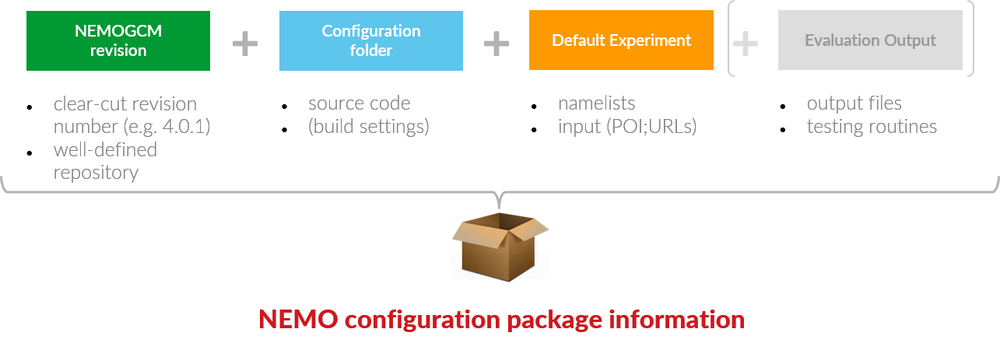

# Getting Started

!!! info "NOTE: User's working environment"
    The structure of the user's working environment can differ significantly. Hence there is no "one-click & go" solution for publishing a simulation package. SIMSAR follows rather a "recipe" guided approach and provides the user with batch scripts or other tools where feasible.


A Simulation Package consists of 

* the **code** (reference to the NEMO revision + the user code modifications), 
* the **build settings** and 
* the **runtime environment** for one or multiple experiments (namelists + input files). 

The package could be expanded optionally by *output data* or *figures* for evaluation (or a reference to them) as well as by *testing/analysis routines*.

<!--////-->

In order to create and publish the simulation package, you'll need to go through these steps:

* [Step-1:  Prepare](#step-1-prepare) 
* [Step-2: Create README](#create-readme)
* [Step-3: Create git repository](#create-git-repository)
* [Step-4: Publish](#publish) 


## Step-1: Prepare

Assuming the path to your copy of the NEMO repository reads `$HOME/NEMO/release-4.0`, let's go into the respective experiment folder of the simulation you want to publish (e.g. experiment `MyExp1` under configuration `My_Config`):

```bash
cd ~/NEMO/release-4.0/cfgs/My_Config/MyExp1
```

!!! caution "check in latest revision"

    It is important that when using svn or git the latest changes have been committed to the version control system:
    
    === "git"
        ```
        git add .
        git commit -m "last checkin before creating README"
        ```
        
    === "svn"
        ```
        svn add .
        ```


### 1.1 List input data files

First, we need a list of the **required input data files** for your simulation together with some detailed meta-data, like sources, references and check-sums. SIMSAR expects this list in a special file, the **`input.ini`** file. If this file does not exists yet, **please create it**. 

You'll find more information about the file format and how to create it in the "**Citable Input Data**" section of this guide or follow these buttons for further details:

[How to refer to Input Data](inputdata.md){: .md-button  .md-button--primary style="margin:10px;"} [The "input.ini" file](input_ini.md){: .md-button  .md-button--primary style="margin:10px;"}

!!! Danger "Important"
	Make sure, that the sources in the `input.def` files (the URLs) are publicly accessible (or grant permissions respectively).


### 1.2 Other meta-data

Meta-data is an essential part of a documentation because it summarizes the most important basic characteristics of a simulation as well as its special features. Some of this information can be identified automatically while other information requires user input, like the textual description of the purpose of a simulation. 

Please, follow the button below to read about which meta information will be needed (from the "**The Simulation Package**" section):

[Simulation Meta Data](simulation-meta.md){: .md-button  .md-button--primary style="margin:10px;" }  


## Step-2: Create README

The meta-information from the preparation step is now assembled in one single document: the **README** file. This document serves both as front-page for the git repository and as static web page (if enabled). It will give the reader a brief overview of the simulation, a list of requirements to re-run the simulation and how to obtain the code and input files.

There is a python script for assistance. Just run the script **mkReadme** from the SIMSAR package and follow the instructions from the user dialog. Click on the following button to read more about the process:

[Create a README (mkReadme)](mkReadme.md){: .md-button  .md-button--primary style="margin:10px;" }  


## Step-3: Create git repository

The Simulation Package will be stored as a *git repository*. During this step you can review the contents of the repository before it will be uploaded in the next step. Depending on your working environment and whether the directory is already under version control, there are slightly different ways of how to proceed. Please, click on the button below to read about how to bundle up from the "**The Simulation Package**" section:

[Bundle up](bundleup.md){: .md-button  .md-button--primary style="margin:10px;" }


## Step-4: Publish

Publishing your Simulation Package is an essential step for the reproducibility of scientific findings. But you should also ensure that it's easy to acknowledge your contribution by referring to your work.  

### 4.1 Persistent Identifier

Instead of referring to email addresses, which can change during a scientist's career, you should link your published Simulation Package with a persistent handler for any citing, e.g. using a DOI. See the "**Persistent Handler**"  in the "**Publish**" section or follow the button below to read about the necessary steps:

[Get a persistent handler (DOI)](publish_pid.html){: .md-button  .md-button--primary style="margin:10px;" }

!!! tip
    If you want to indicate a **persistent handler** (e.g. DOI) **in the README** file (and you should), try to get a **preliminary identifier** from the service provider, modify the README accordingly, then commit to the remote repository in the next step and finally register this commit with the handler provider.

!!! note
    *If you do not want to register a persistent handler for your simulation you can skip this step, of course.*


### 4.2 Submit to a Git Project Server

To give others access to your Simulation Package you need to upload it to some remote git server either as a **public** (recommended) **or private** project. If the project settings allow cloning/forking and so-called merge requests, you can open your Simulation Package for others to contribute to the development. However, most free service providers require the project to be public anyway (or some kind of payed membership) in order to use advanced features, like git pages (for the static web page). 

You'll find some examples on how to upload your git repository to a git server in the "**Publish**" section under:

- [publish via git](publish_git.md){: .md-button  .md-button--primary}


### 4.3 Add Static Webpage (optional)

Not everybody is familiar with git. And in particular, if your intension is just to provide the information for reference (e.g. for scientific publications) and less for real collaboration, you may want to use a static web page instead of a git repository. Some git hosts provide a nice feature in this regard: **git pages**. This feature  allows you to create a static web page from the existing files using a static web content generator as part of a continuous integration technique.

Follow the button below to read more about static webpages in the "**Publish**" section:

* [add static webpage](){: .md-button .md-button--primary}

!!! tip
    This static web page version can also be used with the "unsupported configuration" switch `makenemo -u` to import this simulation into NEMO without using git.


