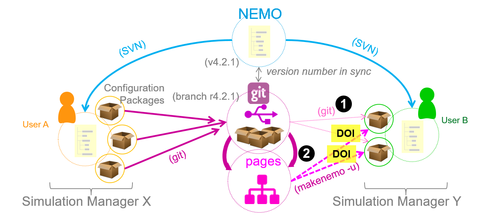

# Introduction

## Modeling the Ocean

Ocean models of today are highly complex computer programs based on mathematical formulations of physical, chemical and biological interrelations. They are essential tools to investigate processes in the ocean from large scales to micro-structures which effect the climate physics, environmental conditions, economic developments and ultimately the human well-being. They can help to understand processes that lead to events in the past as well as to present changes. And it places an instrument to our disposal to look into the future using projections and forecasts.

## Reproducibility

The results and the conclusions of a scientific analysis are the most important outcome in the wake of an ocean simulation effort. But the interpretation of the results must be verifiable and the simulation itself thus reproducible. Therefore, the knowledge about how the simulation was created and run is of equal importance and cannot be neglected. To fulfil this obligation of reproducibility every component of and input for a simulation must be documented in a well-defined, reliable, citable and thus sharable way.

## What is sharing for you? Publishing? Collaborating?

If you want to share a simulation with others you may either want to just document what you have done and provide this information to others. Or you may want to develop a configuration together with contributions from different groups.

While the former can be implemented quite easily: Just put the necessary information into one archive and extract some of the meta data for a summary; no further contribution intended. 

The latter (collaboration) needs a more complex solution: You'll have to make sure, that the development is version controlled and each contributor can be identified (not only to track bugs but also to acknowledge and to give credit for their contributions).

## NEMO

The NEMO framework ([nemo-ocean.eu](https://www.nemo-ocean.eu){: target=_blank}) provides the code and tools to compile a computer program in order to simulate the ocean and its diverse components. 

Besides the physical ocean, also a sea-ice and a biogeochemical tracer module can both be included. The final program code is assembled during the compilation process and factors in additional pre-compiler choices (like model functionalities, competing parametrization and algorithms) and code modifications made by the user. The setup for such a specific executable program is called a "**configuration**". 

Although the same configuration can be compiled using different compilers for different machines, the same executable can be used however to run different "**experiments**". These experiments or "runs" differ on parameter choices made in separate **namelist** files, which are evaluated during run-time. They may also start from different initial conditions (e.g. the ocean state, like temperature, salinity and current velocities) and may respond to different boundary condition data (like geothermal bottom heat or atmospheric forcing), all read from external **input data sets**.

NEMO is shipped with several [build-in configurations](https://forge.ipsl.jussieu.fr/nemo/chrome/site/doc/NEMO/guide/html/configurations.html#list-of-configurations){: target=_blank} including example parameter sets to demonstrate different kinds of application. The necessary input data files for these configurations can be downloaded from a data repository (see link in the cited NEMO documentation).

!!! info "Test Cases"
    NEMO also provides a bunch of **idealized test cases**. Each in the shape of a configuration folder they reside in a separate NEMO directory and are meant to test certain features, algorithms and functionalities of the code. The full collection can be retrieved from a separate [git repository](https://github.com/NEMO-ocean/NEMO-examples){: target=_blank} which is open to contributions from the community.

!!! fail "Missing User Configuration Documentation"
    While the build-in configurations in NEMO are sufficiently documented, version-controlled and even the input files are linked to a permanent object identifier, there is no recommended way of keeping records of user configurations.

## NEMO-SIMSAR

**NEMO-SIMSAR** aims to fill the gap of documenting NEMO simulations created by users and introduces a consistent concept and provides recipes and tools for the user.

The concept behind NEMO-SIMSAR does not only emphasize [univocally citable input data sets](inputdata.md) but also introduces a more comprehensive definition of a [simulation package](#) and its components than the original concept of configurations and experiments stipulates. The preferred repository system for [publishing your simulation](#) with SIMSAR is *git* (but other platforms and protocols might be applicable, too). 

The figure below illustrates the workflow: 

1. User A (Simulation Manager X) has a copy of the NEMO framework repository containing several experiments under different configurations
2. User A creates one ore more Simulation Packages and publishes them each in a separate git project. User A also has the option to create additional static pages from the git project in order to support the `makenemo -u`.
3. User B, also having a copy of the NEMO framework repository, clones one or more of these git projects to work with. In this case, User B could also contribute to a simulation package by uploading their own version and submitting a merge request to the respective git project.
4. User B could also import a simulation package using the static pages version of the git project and the "unsupported configuration" switch with the build tool: `makenemo -u`. In this case no contributions could be made directly to the simulation project unless the simulation package is re-imported invoking step 3.
5. DOIs could refer either to the git project version or the static pages version. In a two-level-access approach a DOI could refer to the static page version which in turn provides a link to the original repository.

<!--//SIMSAR uses DOIs provided by [zenodo](https://zenodo.org/) as permanent handlers for referring simulations and imput data (but could be replaced with other data-handler services by the user).//-->

&nbsp;  

[Getting Started](gettingstarted.html){: .md-button .md-button--primary }

&nbsp;  
