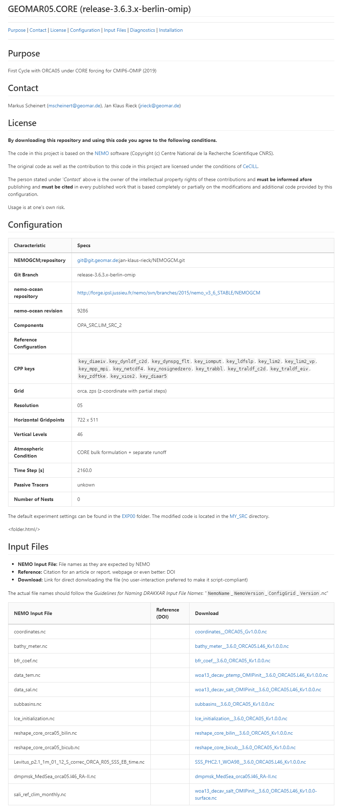

# Create the README file with **mkReadme**

**mkReadme** helps you creating a README file that summerizes the characteristics of a simulation (an experiment with a specific configuration) as Markdown file (*README.md*).

## Step-by-Step

!!! tip "Experiment Folder"
    Please, be aware, that currently **mkReadme** expects you to be wihtin the NEMO repository tree.
    If your **experiment folder** is outside of e.g. `NEMO/cfgs/WhateverConfig/YourEXP`, please consider
    finding a work-around by e.g. copying the necessary files temporarily into the NEMO repository tree 
    (no need to copy the huge input data files, `input.ini` will be sufficient).
​    

1. Go into the folder of the exxperiment you want to publish.
2. Run **`mkReadme`** and provide input when asked :
   1. Confirm with >**y**<  when you're ready and prepared (see list on the screen)
   2. The ascertained name of the configuration and experiment are printed on screen for controlling purposes only
   3. Your're asked for your full name (given name and family name).  
      Confirm with >RETURN<
   4. You're asked for your email address (both will apear as "Contact" on the README page).  
      Confirm with >RETURN<
   5. Now type in a short notice on the purpose of the experiment; You can modify an existing text, if you have invoked the script before  
      Confirm with >RETURN<
   6. The Script now checks some information and will put some control output on screen:
      * Are we already in a svn or git repository? And if so, what is the registered remote repo?
      * What was the original NEMO repository URL?
      * What is the revision number for the svn repository root?
      * Prints the branch name (parent folder of the NEMO code in the original svn repository)
      * Prints a list of components used for the current configuration (from `cfg.txt`/`ref_cfgs.txt`/`work_cfgs.txt`)
   7. You're asked now whether there is a previous 'parent' configuration you want to link this configuration to? Leave it empty if there is no such parent config.  
      Confirm with >RETURN<
   8. You may want to insert the URL of a remote repository for the parent configuration from the step before. Leave it empty if there is no such URL.  
      Confirm with >RETURN<
   9. some basic grid information is determined and printed on screen:
      * Horizontal Resolution
      * Grid Type
      * Vertical grid type
      * Horizontal grid numbers
      * Number of vertical levels
      * Type of atmospheric forcing
      * Dynamic time step
   10. Now you're asked for the number of AGRIF nests (just keep it zero (0) if there are no nests).  
       Confirm with >RETURN<
   11. Finaly, you can type in a list of passive tracers, if necessary.  
       Confirm with >RETURN<
   12. Your README.md file ist written.
3. Load the README.md in a Markdown Viewer or in some ASCII editor to check the information therein.

Now proceed with the next step: [Bundle Up](bundleup.md)

[Bundle Up](bundleup.html){: .md-button .md-button--primary }

&nbsp;  

## Example

> 