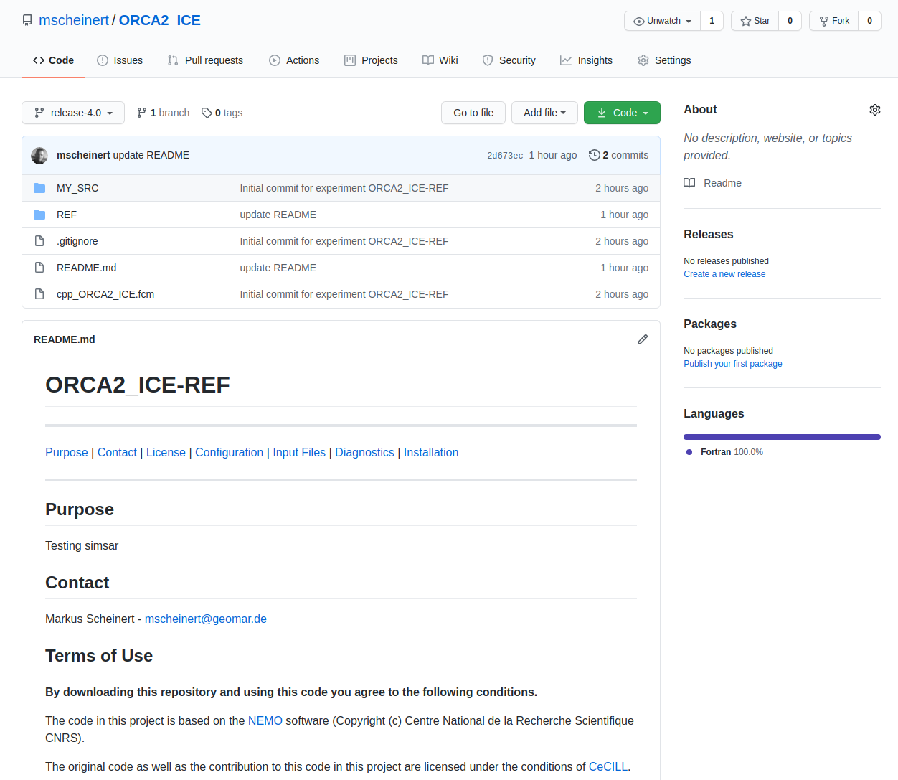

# Publish via GIT

There are several service providers hosting remote git servers which can be used free of charge. You may even have access to your own git server on premise. No matter which way, choose one which can be **easily accessed** and is available even on the **long run**.

## Preparation

Before you proceed, make sure you have a local git repository for your simulation ready as it is shown in the [Bundle Up](bundleup.md) section. If not, please follow the instructions therein and come back afterward.

Make sure, you have access to the git remote server and you have **permission to create new repositories/projects** or modify existing ones. I.e. you have registered a **ssh key** for authentication via SSH-connections, or you have a private or project related **token** for HTTPS-connections. 

If you're going to create a new repository within a **special name space** (group/team/organization) make sure you're granted with some write/maintain permissions therein as well; contact the group/team/organization leader (owner) to request permission.


## New git project

If this is the first time, your *Simulation Package* will be submitted to a remote repository, you'll have t create a new remote project. Please follow the **instructions for new repositories** given by your **git provider**. 

In some cases you might be just able to create it **on-the-fly** by pushing into a project with a not-yet existing URL (If not, step 2 will fail).

### 1. Add remote host

Go into your local git repository containing your Simulation Package and add a new *git remote*. In the example below, the name 'origin' is used to identify the remote, which is the default for the first remote repository. But you can choose another name of course as you like; in particular if you are going to have more than one remote and you want to reserve the name 'origin' for your private repository, or origin already exists. You can check existing remote entries with the command **`git remote -v`** while **`git remote add`** registers a new remote connection.
```
cd $WORK/NEMO/release-4.0/cfgs/ORCA2_ICE/
git remote add origin git@github.com:mscheinert/ORCA2_ICE.git
```

!!! tip "Name of the Repository/Project"
	The directory you're going to push into a remote repository is a configuration folder. Nevertheless you may want to name the repository using a **composite** of both the configuration and experiment name if your repository will only contain one experiment:	**`ConfigurationName`**`-`**`ExperimentName`**

!!! danger "Access Level"
	Most git hosts provide different types of repositories: **private** and **public** ones and those with **ACL** (Access Control List). 
	Please make yourself familiar with the available options and choose wisely.  Submitting to a group though may constrict your choices (e.g. no public repo in a closed group).
	

	**Simulation Packages with a DOI MUST BE PUBLIC!**


### 2. Push to Remote

```bash
git push -u origin release-4.0
```

!!! note "EXAMPLE"
	See git repository [ORCA2_ICE on GitHUB](https://github.com/mscheinert/ORCA2_ICE){: target=_blank}.
	
	

	{: .frame .imgshadow style="width:100%;margin:auto"}

### 3. Update

If you have changes you want to submit to remote, just add them, commit with a short message what has changed and push it to the remote. For example, if something was updated in the README:

```bash
git add README.md
git commit -m "UPDATE Readme file: Added DOI"
git push
```


